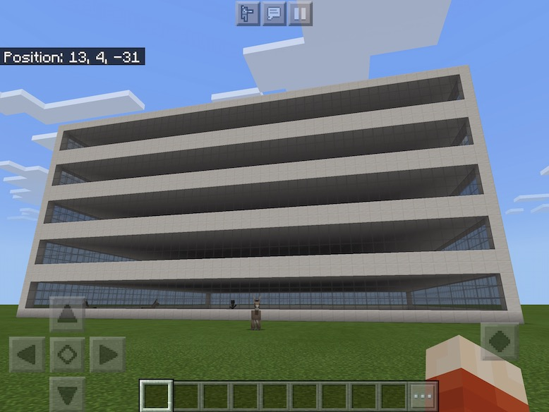

# "Tom's Buildings" Minecraft Add-on
This is an add-on for Minecraft Bedrock Edition. It is a behavior pack that adds building-creating functions to your world.

### Included Functions
- `tb-hut` Builds a small hut with a window and door.
- `tb-b5` Builds a 5-story building with quarts blocks and gray stained glass windows.

**Example usage.** The `tb-hut` function adds a small hut.
```
/function tb-hut
```

### Build
Run the following commands from the terminal:
```
% zip -rX Toms-Buildings.zip Toms-Buildings
% mv Toms-Buildings.zip Toms-Buildings.mcpack

```

### Install
Tap on the `.mcpack` file on your iPad.  There are various ways to get the file on your iPad:
- AirDrop it (my favorite)
- Add it to iCloud Drive and then browse to it on the iPad using the Files app
- Email it as an attachment

_A building created by a single function call!_
